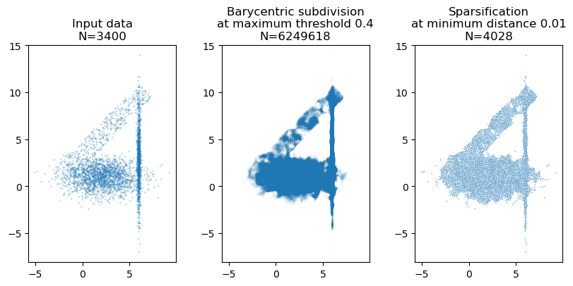

# TopoAware
Topologically aware constructions for ecological hypervolumes

**UNDER DEVELOPMENT:** This project is still being developed. Documentation and source code is not yet finalized. For more information, please contact [the developer](https://jlazovskis.com/).

## About
The purpose of this software is to use topological tools, in terms of computational efficiency and theoretical guarantees, to construct hypervolumes for use in ecology. Hypervolumes are usually constructed as kernel density estimators, but those are often less interesting topologically at the expense of knowing more information (precisley "filling in" the holes of missing data). This software aims to retain toological information of the input sample while still providing the user with more information about the space in which the sample lies.

Ideas are borrowed from:
* [hypervolume](https://github.com/bblonder/hypervolume): The orginal program to generate hypervolumes via kernel density estimators
* [ripser](https://github.com/Ripser): Efficient constructions of simplicial complexes
* [gudhi](https://gudhi.inria.fr) : Sparsification methods

## Usage

`TopoAware` can be used directly with the provided releases, or can be compiled from the source code. For most users using the releases is suggested.

### Releases and installation

The current release is `0.1.0`. A compiled executable `TopoAware` from the C++ source is provided, which can be used immediately from the command line. An `R` package `TopoAware` is also provided, which can be installed by launching `R` in the same folder as the downloaded `.tar.gz` file, and calling:

    > install.packages("TopoAware_0.1.0.tar.gz", repos = NULL, type = "source", dependencies = TRUE)

The dependencies are `BH`, `Rcpp`, `RcppEigen`, `RcppCGAL`. Common issues of this command failing could be related to having an older version of `R` or needing to update the packages. Please submit an issue if this approach does not work for you. A proper release on CRAN is planned. 

### Compiling and dependencies

`TopoAware` depends on other C++ libraries:
* [boost](https://www.boost.org) : C++ Libraries
* [Eigen](https://eigen.tuxfamily.org) : Template library for linear algebra
* [CGAL](https://www.cgal.org) : Computational Geometry Algorithms Library
* [GUDHI](https://gudhi.inria.fr) : Sparsification methods

All of these libraries are necessary only for the `sparsify_points` function.

#### Compiling in C++

The mentioned libraries need to be present on you machine to compile `TopoAware`.

Compile `TopoAware`, for example with `g++`.

    g++ -o TopoAware -I include TopoAware.cpp

Then run the program on a data set, indicating the distance `bdist` at which to add barycenters for 1-simplices and 2-simplices, and the distance `sdist` at which to sparsify by maintaining this minimum distance between any two points. Example with provided data below.

    > ./TopoAware --input examples/test_shape.csv --output examples/test_out.csv --bdist 0.5 --sdist 0.05
    > TopoAware 0.1.1
    > --------------------
    > (time: 0 seconds) Loading input file... done (1524 points)
    > (time: 0 seconds) Adding barycenters to all pairs and triples within 0.5...  done (11795912 points = 129822 from pairs, 11664566 from triples)
    > (time: 31 seconds) Sparsifying with minimum distance 0.0001...  done (39883 points)
    > (time: 574 seconds) Exporting sparsified point cloud to file... done
    > --------------------
    > Finished in 574 seconds

In general, `sdist < bdist`, as having the sparsification distance larger than the barycentric subdivision distance voids the need for barycentric subdivision. That is, just sparsifying the input data set would yield the same result as first subdividing, then sparsifying.

#### Compiling in R

The `C++` code has been ported to `R` using the `Rcpp` package. Dependencies on the other libraries are sorted either by including the header files (in the case of GUDHI), or by requiring the respective ported packages as dependences (boost as [BH](https://cran.r-project.org/web/packages/BH), Eigen as [RcppEigen](https://cran.r-project.org/web/packages/RcppEigen), and CGAL as [RcppCGAL](https://cran.r-project.org/web/packages/BH)).  3.8.0 included  If you already have the mentioned libraries on your machine, you can use the `sourceCpp` command from the `Rcpp` library to immediately start using the code. 

    > library('Rcpp')
    > sourceCpp('TopoAware_sourceCpp.cpp')
    > df <- read.csv('examples/2d_input.csv')
    > df2 <- topological_hypervolume(data=df, dist_barycenter=0.6, dist_sparsify=0.01)

# TODO

* Documentation
* Replace cout in R port with appropriate method
* Move examples to new subsection, align variable names
* Test cases
